# Heaps
- Use it when the question requires to get maximum and minimum value of some sort

## Max heap
- Root has highest value
- Its child will have lower value
- Tree is a complete tree, i.e. level is full, filled from left to right
- Value of a node is always greater than value of child node.
- Specifying by array is easy.
- Lets start element at index 1, so it becomes easier to know the parent and child.
- Parent becomse current_index/2
- Left child = current_index * 2
- right child = current_index * 2 + 1

## Inserting into heap
- Lets take the following example
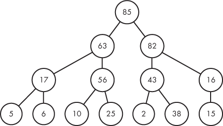
- We want to insert 32
- We will inser to bottom most right
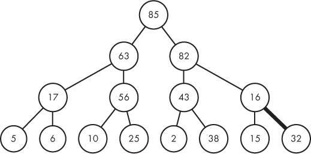
- Heap is not sorted now
- So we compare it with its parent, if it is greater than its parent, we swap
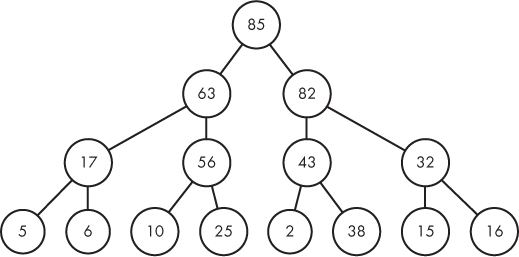
- Now lets add 91, since bottom right is full, we add to left most
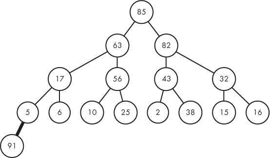
- Uh oh not sorted, we compare with parent and keep on doing till no parent is greater than it
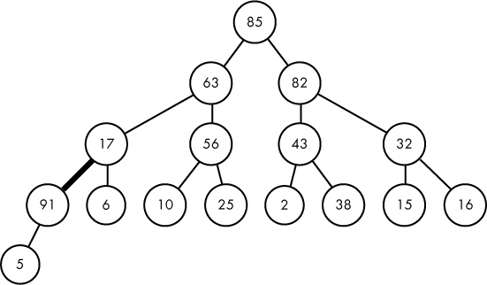
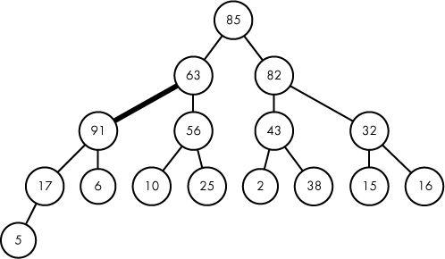
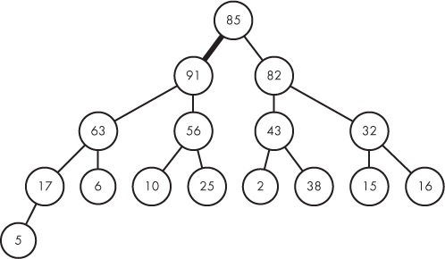
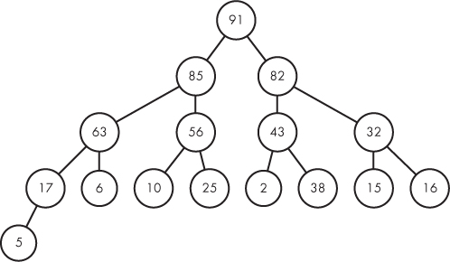

## Extracting from Max heap
- We remove the root value from max heap
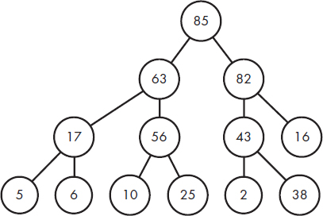
- We remove from top and put bottom right most value on top
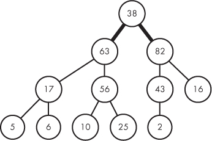

- We check if swapped value is smaller than child, if so swap against the child with most large value
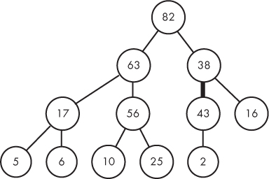
- Keey on going till we reach bottom
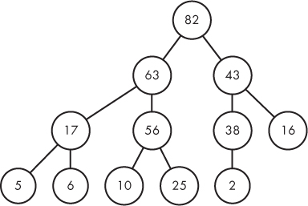
## Min heap
- For min heap, do similar, expcet swap with lower value

## Custom implmentation in Golang
```go
// num_heap is the counter that holds number of elelemtns in heap
// rest 2 are problem specific values
func max_heap_insert(heap *[MAX_RECEIPTS + 1]heap_element, num_heap *int, receipt_index, cost int) {
	temp := heap_element{}

	(*num_heap)++ // since we are inserting, increase the number of elelemnts by 1

	// add value to the heap
	heap[*num_heap] = heap_element{receipt_index: receipt_index, cost: cost}
	i := *num_heap

	// since we are indexing array by 1, make sure index is greater than 1,
	// continue looping till the current element is > than its parent, which means we need to swap
	// since we are indexing starting from 1, parent is i/2
	for (i > 1) && (heap[i].cost > heap[i/2].cost) {
		temp = heap[i]      // hold current value in temp
		heap[i] = heap[i/2] // replace current index pos with parents
		heap[i/2] = temp    // replace parents index with current
		i = i / 2           // replace index with parents, next we will check if parent is at the right place
	}
}

func max_heap_extract(heap *[MAX_RECEIPTS + 1]heap_element, num_heap *int) heap_element {
	var remove, temp heap_element

	remove = heap[1]          // return the root
	heap[1] = heap[*num_heap] // replace the root with bottom most right child
	(*num_heap)--
	i := 1

	// loop till we have at least left child
	for (i * 2) <= *num_heap {
		child := i * 2

		// check if child index is less than num_heap, and right child is > left child, increase
		// child index, since +1 is right child
		// basically we are chekcking if right child is greater than left child
		// if it is, increase the child index
		if (child < *num_heap) && (heap[child+1].cost > heap[child].cost) {
			child++
		}

		// if the child is greater than the cost then the heap is not sorted
		if heap[child].cost > heap[i].cost {
			temp = heap[i]
			heap[i] = heap[child]
			heap[child] = temp
			i = child
		} else {
			break
		}

	}

	return remove
}

func min_heap_insert(heap *[MAX_RECEIPTS + 1]heap_element, num_heap *int, receipt_index, cost int) {
	temp := heap_element{}

	(*num_heap)++ // since we are inserting, increase the number of elelemnts by 1

	// add value to the heap
	heap[*num_heap] = heap_element{receipt_index: receipt_index, cost: cost}
	i := *num_heap

	// since we are indexing array by 1, make sure index is greater than 1,
	// continue looping till the current element is > than its parent, which means we need to swap
	// since we are indexing starting from 1, parent is i/2
	for (i > 1) && (heap[i].cost < heap[i/2].cost) {
		temp = heap[i]      // hold current value in temp
		heap[i] = heap[i/2] // replace current index pos with parents
		heap[i/2] = temp    // replace parents index with current
		i = i / 2           // replace index with parents, next we will check if parent is at the right place
	}
}

func min_heap_extract(heap *[MAX_RECEIPTS + 1]heap_element, num_heap *int) heap_element {
	var remove, temp heap_element

	remove = heap[1]          // return the root
	heap[1] = heap[*num_heap] // replace the root with bottom most right child
	(*num_heap)--
	i := 1

	// loop till we have at least left child
	for (i * 2) <= *num_heap {
		child := i * 2

		// check if child index is less than num_heap, and right child is > left child, increase
		// child index, since +1 is right child
		// basically we are chekcking if right child is greater than left child
		// if it is, increase the child index
		if (child < *num_heap) && (heap[child+1].cost < heap[child].cost) {
			child++
		}

		// if the child is greater than the cost then the heap is not sorted
		if heap[child].cost < heap[i].cost {
			temp = heap[i]
			heap[i] = heap[child]
			heap[child] = temp
			i = child
		} else {
			break
		}

	}

	return remove
}

```

## Gos own container heap
https://pkg.go.dev/container/heap
