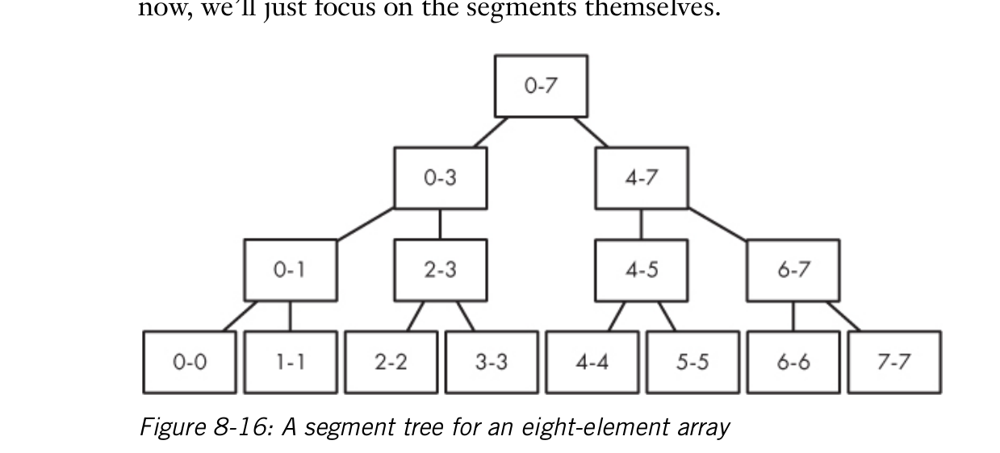

# Segment Trees
- Segment trees, each node will hold some value (depending on the question), lets say, max value withing a certain range.
Example:

- Here we hold the maximum value within the index range.

## How to build it ?
- Recursion
- **_Base conditon_** is if left index and right index is same, the max value will be either inderx value since both are same.
- If not base condition, we get the max values from left child node and right child node, and whichever is the greatest (or smallest or high priority depending on the requirement) we mark that as the value.
- We keep on doing this for all.

## How to query?
- First we check root node, is it within range?
- If yest return value.
- Ex: 4-7, is root node within range, no, so we check both left and right.
- Left node will be out of range, so we check right, right has exact match, we return that,
- If exact is not found, we get max of both child nodes within that range and we return that.
- Example: for 0-6, root is within that but does nto match exactly
- SO we check left, 0-3 is within, we get value from that, 4-7 is within, we got furhter in its child, 4-5, 5 ix the max range so we have to return that. so we get value from that
- Now we compare which is greatest and we return that.
- For code look at [here](./algorithmic_thinking/chapter_8/building_trees/main.go)