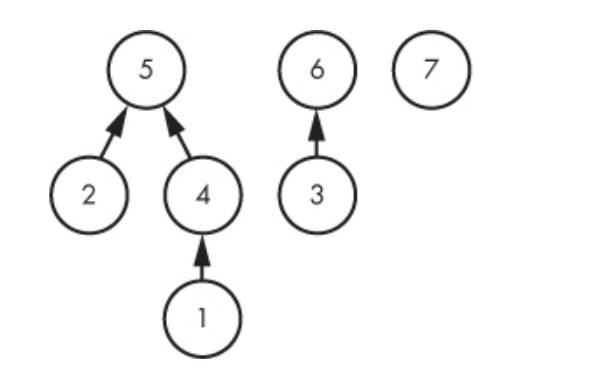
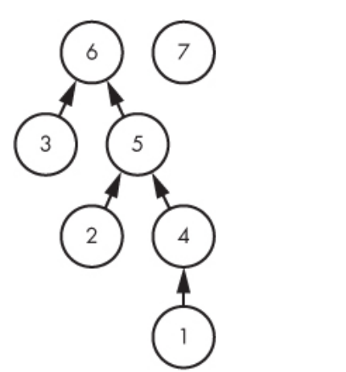
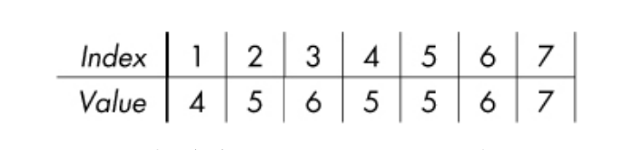

# Union find

## When to use?
- Three properties must be met
- **Relfexive**: Objects must be related to themselves. Ex: A friend in social network is friend to themselves.
- **Symmetric**: Relation must be directionless. Ex: if x is friend of y, then y is atuomatically friend of x.
- **Transitive**: Relation must cascade. Ex: If x is friend of y, and y is friend of z, then x is friend of z.
- Ask the question, Is the relationship between obects reflexiv, symmetric and transitive? If so then primary objectvice can be mapped to Finds and Unions.
- Union Find turobcharges graph problems whose primary operation is Union and FInd.
- Union, we take 2 sets together and create one larger sets.

## Explaination
- This structure is better explained through a problem.
```
Your friend came up with an idea of starting a social network-SOCNET. Since, he is not as good a programmer as you are he needs your help to build certain features.

You need to build an ADD friend feature. if 'x' sends a friend request to 'y', he may accept it or deny it.

SOCNET has a special feature called 'community'. When two people 'x' and 'y' becomes friends, the communities of two are merged together. (If 'x' has no friends, it's community consist of only himself, size-1)

Since, your friend is low on funds, the data center he uses has a restriction-the MAXIMUM size of any community cannot exceed 'm'.

You need to work on following three types of queries-

* A x y - x sends a friend request to y
* E x y - check whether x and y are present in same community (print 'Yes' or 'No')
* S x - prints the size of the community 'x' belongs to.

NOTE- A friend requested is accepted only if the merger of the two communities results in a community not greater than 'm'.

### Input

The first line of input consists of two positive integers - n and m(n is the number of registered users and m is the maximum size of any community).

Next line consist of a positive integer q (number of queries).

q lines follows (Each line consist of a query as described in the problem statement).

The queries follows 1-indexing.

### Constraints

1<=n, m<=100000, 1<=q<=200000

### Output

For each query of Type - 'E', output in a single line-'Yes' or 'No'. For each query of Type - 'S', output the size of the community to which 'x' belongs. For further clarification, read the example given.

### Example

```
Input:
5 3
8
S 2
A 2 3
E 2 3
S 2
A 4 5
A 3 5
E 3 5
S 3

Output:
1
Yes
2
No
2
```

### Explanation

Initially no one has any friend. So community of '2' consist of only '2' i.e. size-1. Then '2' and '3' becomes friends .This forms a community of 2 people. '4' and '5' also becomes friends. This forms another community of 2 people. '5' is unable to accept friend request of '3' (because it would result in a community of 4 people(>3).

```

- Basically There are froends `A` operation makes 2 people friends, `E` is use dot check if 2 people are friends, `S` is used to get size.
- In Union, we make a single friend a representative of the entiere community.
- We make the `root` as the `representative`, and if we want to connect two firends two togetherm, we combine both community and make them as one, and have a single representative since the property is transitive.
- Example: we have the following tree of friends

- Now we get `A` operation of 1 and 3, now we combine 2 community wiht same root

- Now when we want to check if 2 people are friends, we check if their root are same.
- Array reprenstation

- In array, 1 has parent 4, 4 has parent 5 and 5 has its own parent, so 5 is root
- 2 has parent 5 and 5 is root
- So 1 and 2 are friends since they have same root.
- If u look at the code at [code](./algorithmic_thinking/chapter_9/social_network/main.go), we use `parent` array, so each index number, will be people number (westart at 1), and initially everyone has its own parent.
- When we get `A` operation, we use the `union` function to combine 2 community.
```go
func union(person1, person2 int, parent, size *[MAX_PEOPLE + 1]int, num_comunity int) {
	var community1, community2 int
	community1 = find(person1, parent)
	community2 = find(person2, parent)

	// if the representative of these guys are not the same
	// and when we unionize the size will still stay within the size limit
	if (community1 != community2) && size[community1]+size[community2] <= num_comunity {
		// Setting the root node of communi1 to the root node of community2
		// aka, the preveious representative of community1, which had no representative at all
		// will have the representative of community2 be set as its representative, thus making all its children
		// be represented by that new representative
		parent[community1] = parent[community2]

		// increas the total community size
		size[community2] = size[community2] + size[community1]
	}
}
```
- First we check if both same have root, if not,
- we check if size has reached its limit (question want sto limit community size).
- If not we set community1 to be child of community 2 parent, this we both community will bhave representative of community2.
- Ex; if our array was the following and we wanted to combine 1 and 3
[1 2 3 4 5 6 7]
[4 5 6 5 5 6 7]
- We would see that 1 has root 5, and 3 has root 6.
- So we would then we would end up making 6 the parent of 5, so final array would be
[1 2 3 4 5 6 7]
[4 5 6 5 6 6 7]

## Optimization
- **Union By Size**: Union the community with fewer people into community with larger. This way number of edges wiill be small
- **Path Compression** : If once a root node has been found, we set the parent to root directly, Not alawys applicalbe sometimes we want to remember the entire path too. 
